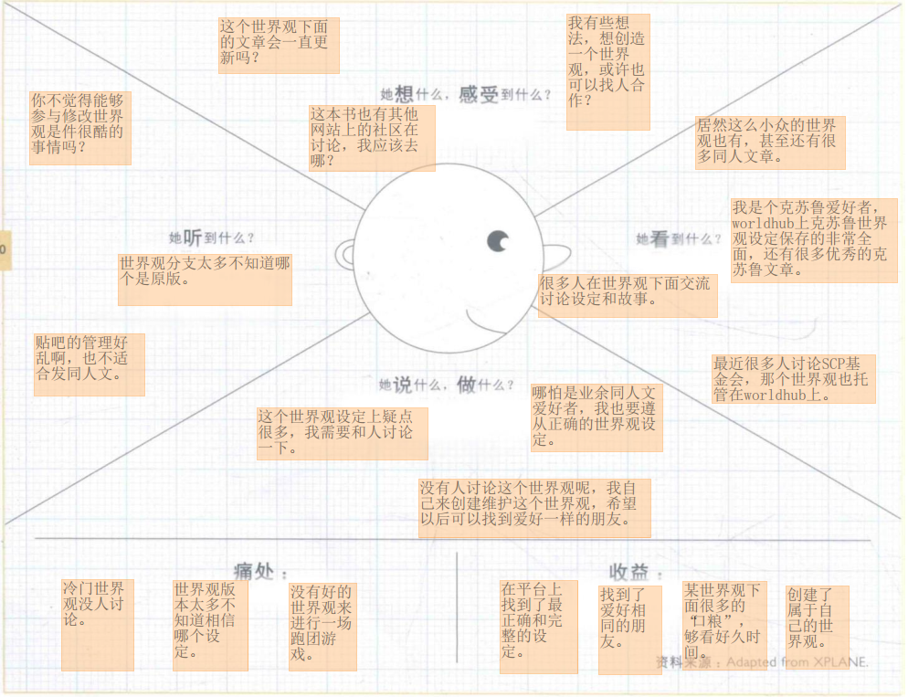

# 一、客户洞察（移情图）

## Part1

模拟的是一个普通的某世界观爱好者

### 看：

最近很多人讨论SCP基金会，那个世界观也托管在worldhub上。

我是个克苏鲁爱好者，worldhub上克苏鲁世界观设定保存的非常全面，还有很多优秀的克苏鲁文章。

居然这么小众的世界观也有，甚至还有很多同人文章。

很多人在世界观下面交流讨论设定和故事。

### 听：

你不觉得能够参与修改世界观是件很酷的事情吗？

世界观分支太多不知道哪个是原版。

贴吧的管理好乱啊，也不适合发同人文。

### 想&感受：

这个世界观下面的文章会一直更新吗？

这本书也有其他网站上的社区在讨论，我应该去哪？

我有些想法，想创造一个世界观，或许也可以找人合作？

### 说&做：

这个世界观设定上疑点很多，我需要和人讨论一下。

哪怕是业余同人文爱好者，我也要遵从正确的世界观设定。

没有人讨论这个世界观呢，我自己来创建维护这个世界观，希望以后可以找到爱好一样的朋友。

### 痛点：

冷门世界观没人讨论。

世界观版本太多不知道相信哪个设定。

没有好的世界观来进行一场跑团游戏。

### 收益：

在平台上找到了最正确和完整的设定。

找到了爱好相同的朋友。

某世界观下面很多的“口粮”，够看好久时间。

创建了属于自己的世界观。

## Part2

模拟的是一个文娱创作者或者厂商

### 看：

这个网站上的确有很多有趣的设定。

来看看最近热门的世界观是什么样子的。

最近有很多作家把自己的世界观设定发了上来。

热门ip太贵了！这个平台上一些设定很便宜甚至免费。

### 听：

你上次写的书设定太老土了，换个新颖一些的。

这个世界观好有趣啊，好想看到它被写成书或者做成游戏。

粉丝们帮我写了个新设定和人物，希望我加进去。

### 想&感受：

这个平台或许是个固定的灵感来源？

我把我的设定发上来，或许可以让大家改改不合理的地方？

我原本的世界观很薄弱，竟然被粉丝完善到了这个地步？

### 说&做：

我要创造一个热门世界观设定，先来这个平台上观察观察。

我可以把自己新书的设定发上来，来给自己吸引热度，也可以通过粉丝讨论规避不合理。

我们可以在这个平台上找个热门世界观制作游戏。

### 痛点：

最近灵感枯竭，想不出设定和任务来了。

没有很合适的工具来来保存维护我的世界观思路和设定。

想要出一款游戏，缺少热门的世界观设定。

### 收益：

我的世界观被完善了，也知道了大家的观点。

有可以商用的免费设定库。

有游戏厂商希望用我的世界观设定，我可以获得一定的版权费。

游戏厂商找到了热门的世界观设定，有希望大卖。

# 二、构思

[TOC]

## 候选商业模式创新

| 候选商业模式创意                                             | 驱动因素                                                     | 如果…会怎样                                                  | 对整个商业模式画布的影响                                     |
| ------------------------------------------------------------ | ------------------------------------------------------------ | ------------------------------------------------------------ | ------------------------------------------------------------ |
| 世界观、角色创造大赛、打榜                                   | 供给驱动：新的价值主张——共同创造                             | 假如涌现了大量优秀的世界观、角色的设定，那么我们也许能够将这些优秀的创作向第三方输出、变现。 | 客户关系：用户参与的共同创作；核心资源：通过创作大赛，增加平台中优秀的世界观设定 |
| 世界观设定推荐                                               | 客户驱动型：基于用户（写手、读者）兴趣推荐世界观，提高他们所感兴趣的世界观的可获得性；让更多优秀但冷门的世界观走进用户视野 | 如果能够进行精准的世界观推荐，那么对于创作灵感匮乏的创作者来说，就能为他们提供idea。 | 价值服务：为用户提供世界观的灵感                             |
| 同类用户推荐、构建社区、进行线下活动                         | 用户驱动型：找到志同道合之人                                 | 如果能够进行精准的用户推荐，那么就能构建一个更好的世界观交流社区；如果可能的话，也许能够在同类用户数量聚集的地点进行线下、周边活动。 | 渠道通路：通过社区交流，提高用户粘度；收入来源：举办线下活动获取收益；关键业务：为读者提供世界观的交流平台 |
| WorldHub提供咨询平台，可有偿换取专业人士的建议。 | 驱动因素：财政驱动，新的收入来源：咨询平台（地理风貌，建筑设计，生物习性，兵器制造，语言编写——类似知乎，可邀请，可指定）。 | 如果世界观中的硬性错误得不到专业人士的纠正？——WorldHub提供咨询平台，可有偿换取专业人士的建议。 | 驱动因素：财政驱动，新的收入来源：咨询平台（地理风貌，建筑设计，生物习性，兵器制造，语言编写——类似知乎，可邀请，可指定）。  | 对整个商业画布的影响：价值服务中加入咨询服务，这项服务主要面向具有世界观创意，却不愿意或者难以跨领域获得专业指导的作者，和具备一定相关领域知识并乐于提供建议的人。同时这项服务可以作为一种收入来源，平台可以从咨询费中获取少量的平台抽成，被咨询者也可以获得利益。客户群体更加多样化，加入更多的领域专家。*是相对硬核的咨询平台，不加入同人文/画交易服务，因为这类服务已经有比较成熟的平台（半次元、米画师、画世界等，此外微博、lofter等平台也有大量的画师/文手可以联系），且门槛较低（一般情况下不需要学习特别专业的知识）。更倾向吸引一些很少和这方面有关联的领域专家（比如编写一种全新的人造语言，需要有一定的语言学知识，但专家一般不会这么做）。 |
| 其他想法：联动，我的世界，用自己的手让自己的世界可视化       |                                                              |                                                              |                                                              |

## 最终确定的商业模式创意

| 商业模式创意                                             | 驱动因素                                                     | 如果…会怎样                                                  | 对整个商业模式画布的影响                                     |
| ------------------------------------------------------------ | ------------------------------------------------------------ | ------------------------------------------------------------ | ------------------------------------------------------------ |
| 世界观、角色创造比赛、打榜                                   | 供给驱动：新的价值主张——共同创造                             | 假如涌现了大量优秀的世界观、角色的设定，那么我们也许能够将这些优秀的创作向第三方输出、变现。 | 客户关系：用户参与的共同创作；核心资源：通过创作大赛，增加平台中优秀的世界观设定 |
| WorldHub提供咨询平台，可有偿换取专业人士的建议。 | 驱动因素：财政驱动，新的收入来源：咨询平台（地理风貌，建筑设计，生物习性，兵器制造，语言编写——类似知乎，可邀请，可指定）。 | 如果世界观中的硬性错误得不到专业人士的纠正？——WorldHub提供咨询平台，可有偿换取专业人士的建议。 | 驱动因素：财政驱动，新的收入来源：咨询平台（地理风貌，建筑设计，生物习性，兵器制造，语言编写——类似知乎，可邀请，可指定）。  | 对整个商业画布的影响：价值服务中加入咨询服务，这项服务主要面向具有世界观创意，却不愿意或者难以跨领域获得专业指导的作者，和具备一定相关领域知识并乐于提供建议的人。同时这项服务可以作为一种收入来源，平台可以从咨询费中获取少量的平台抽成，被咨询者也可以获得利益。客户群体更加多样化，加入更多的领域专家。*是相对硬核的咨询平台，不加入同人文/画交易服务，因为这类服务已经有比较成熟的平台（半次元、米画师、画世界等，此外微博、lofter等平台也有大量的画师/文手可以联系），且门槛较低（一般情况下不需要学习特别专业的知识）。更倾向吸引一些很少和这方面有关联的领域专家（比如编写一种全新的人造语言，需要有一定的语言学知识，但专家一般不会这么做）。 |

# 三、视觉化思考

WorldHub希望为客户提供作为原创世界观设定交流设计的平台提供核心价值。WorldHub可以提供的服务包括接收用户发布的世界观设定，开放已有世界观设定并允许用户提交修改讨论，接收用户提供的原始设定idea；同时，WorldHub将允提供世界观的fork和pull request高级服务。为满足世界观进一步深挖开发需求，WorldHub将提供完整的设定管理工具集，将提供设定关系可视化，标签筛选等服务。并且由此衍生，WorldHub将提供世界观同人作品的发布和交流服务，并允许基于商用许可下的同人作品收费；WorldHub将提供友好的Wiki视图，这将鼓励用户将WorldHub提供的世界观交流服务用于制作第三方作品的Wiki。

因此WorldHub的目标客户将会是一个较为多样的群体。首先是世界观的创作者，他们是发布讨论管理一套世界观设定的创作者，他们可能有不同的实际身份，有idea的设定党、小说游戏作者、Wiki创作者，他们将使用世界观发布和修改讨论的服务，同时也将使用设定管理工具集，对设定进行检验，避免前后不一致，冲突等问题。第二类是同人衍生创作者，他们将使用已发布的设定集创作衍生作品并发布，她们发布的平台可能不尽相同，但我们希望WorldHub能作为同时发布的平台之一，同人创作者将使用同人作品发布管理服务，并可能使用同人作品的收费服务。最后一类是读者，无论是阅读设定集或是Wiki或是同人作品，我们也将为他们提供作品的阅读，交流讨论服务，并允许打赏和付费。

WorldHub的客户关系是社区，这分为两个层次。首先是用户共同创作，这是创作者与创作者之间的关联，创作的世界观将经由创作者之间的合作，变为一个完整的世界。第二是社区讨论交流，这将联系创作者和读者，让创作者可以和读者创作，创作者可以了解读者的看法，读者也可以表达自己的意见。

在渠道通路方面，WorldHub将通过网站推广，与创作者建立联系，获取更多对世界观感兴趣的创作者。之后，WorldHub也将通过开放的同人绘画作品等向外界推广部分世界观，以期与读者和更多创作者建立关联。

WorldHub平台可以通过为专业用户提供大文件的云存储服务和专业的设定逻辑审核等服务，收取订阅或一次性费用。平台支持并鼓励用户通过订阅打赏方式激励创作者以及基于合理授权下的交易（包括付费商用或允许商用授权下的付费阅读），平台会通过抽成获取收益。适当的广告接入也会为平台提供收入。

WorldHub会与网络文学平台和游戏创作者合作，由于WorldHub会为设定集的创作和使用提供一系列完整的工具集合，由此可以减轻作品创作的压力，减少甚至尽可能避免设定吃书，挖坑不填等情况。同时，根据设定集的授权，WorldHub会对外提供免费商用的优秀设定。WorldHub也可以和叨叨记账等平台合作，提供优秀人设，同时获取感兴趣的客户。

WorldHub将会拥有成千上百的优秀世界观设定，这是平台的核心资源所在。WorldHub团队日常业务主要集中在软件平台的开发，运营以及优秀设定集的推广，与合作伙伴共同将世界转化为IP，推广那些优秀新奇有趣的设定创作。

WorldHub的成本主要集中在平台开发维护推广管理上，其中推广将会是一笔巨大的开支。
