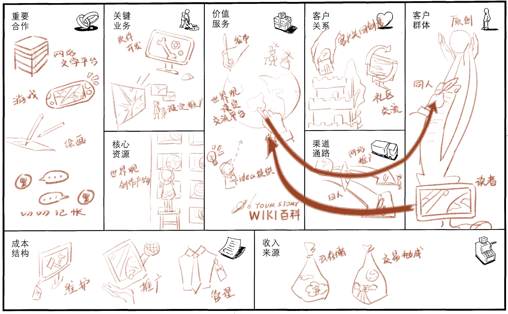

# 可视化讲稿

WorldHub希望为客户提供作为原创世界观设定交流设计的平台提供核心价值。WorldHub可以提供的服务包括接收用户发布的世界观设定，开放已有世界观设定并允许用户提交修改讨论，接收用户提供的原始设定idea；同时，WorldHub将允提供世界观的fork和pull request高级服务。为满足世界观进一步深挖开发需求，WorldHub将提供完整的设定管理工具集，将提供设定关系可视化，标签筛选等服务。并且由此衍生，WorldHub将提供世界观同人作品的发布和交流服务，并允许基于商用许可下的同人作品收费；WorldHub将提供友好的Wiki视图，这将鼓励用户将WorldHub提供的世界观交流服务用于制作第三方作品的Wiki。

因此WorldHub的目标客户将会是一个较为多样的群体。首先是世界观的创作者，他们是发布讨论管理一套世界观设定的创作者，他们可能有不同的实际身份，有idea的设定党、小说游戏作者、Wiki创作者，他们将使用世界观发布和修改讨论的服务，同时也将使用设定管理工具集，对设定进行检验，避免前后不一致，冲突等问题。第二类是同人衍生创作者，他们将使用已发布的设定集创作衍生作品并发布，她们发布的平台可能不尽相同，但我们希望WorldHub能作为同时发布的平台之一，同人创作者将使用同人作品发布管理服务，并可能使用同人作品的收费服务。最后一类是读者，无论是阅读设定集或是Wiki或是同人作品，我们也将为他们提供作品的阅读，交流讨论服务，并允许打赏和付费。

WorldHub的客户关系是社区，这分为两个层次。首先是用户共同创作，这是创作者与创作者之间的关联，创作的世界观将经由创作者之间的合作，变为一个完整的世界。第二是社区讨论交流，这将联系创作者和读者，让创作者可以和读者创作，创作者可以了解读者的看法，读者也可以表达自己的意见。

在渠道通路方面，WorldHub将通过网站推广，与创作者建立联系，获取更多对世界观感兴趣的创作者。之后，WorldHub也将通过开放的同人绘画作品等向外界推广部分世界观，以期与读者和更多创作者建立关联。

WorldHub平台可以通过为专业用户提供大文件的云存储服务和专业的设定逻辑审核等服务，收取订阅或一次性费用。平台支持并鼓励用户通过订阅打赏方式激励创作者以及基于合理授权下的交易（包括付费商用或允许商用授权下的付费阅读），平台会通过抽成获取收益。适当的广告接入也会为平台提供收入。

WorldHub会与网络文学平台和游戏创作者合作，由于WorldHub会为设定集的创作和使用提供一系列完整的工具集合，由此可以减轻作品创作的压力，减少甚至尽可能避免设定吃书，挖坑不填等情况。同时，根据设定集的授权，WorldHub会对外提供免费商用的优秀设定。WorldHub也可以和叨叨记账等平台合作，提供优秀人设，同时获取感兴趣的客户。

WorldHub将会拥有成千上百的优秀世界观设定，这是平台的核心资源所在。WorldHub团队日常业务主要集中在软件平台的开发，运营以及优秀设定集的推广，与合作伙伴共同将世界转化为IP，推广那些优秀新奇有趣的设定创作。

WorldHub的成本主要集中在平台开发维护推广管理上，其中推广将会是一笔巨大的开支。
